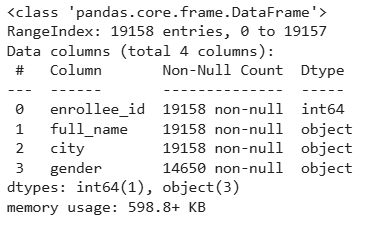
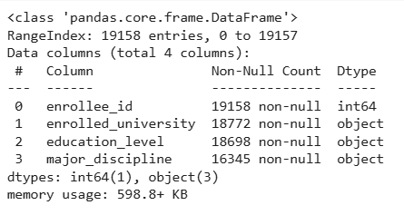
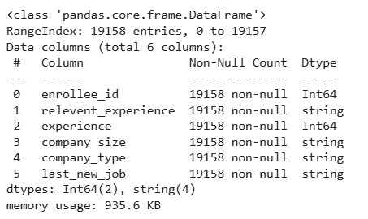

# ETL PROCESS: HR Analytics - Job Change of Data Scientists
## Intorduction

A company which is active in Big Data and Data Science wants to hire data scientists among people who successfully pass some courses which conduct by the company.

Many people signup for their training. Company wants to know which of these candidates are really wants to work for the company after training or looking for a new employment because it helps to reduce the cost and time as well as the quality of training or planning the courses and categorization of candidates.

Information related to demographics, education, experience are in hands from candidates signup and enrollment.

## Data Sources

### Enrollies' data

As enrollies are submitting their request to join the course via Google Forms, we have the Google Sheet that stores data about enrolled students, containing the following columns:

- enrollee_id: unique ID of an enrollee
- full_name: full name of an enrollee
- city: the name of an enrollie's city
- gender: gender of an enrollee
The source: https://docs.google.com/spreadsheets/d/1VCkHwBjJGRJ21asd9pxW4_0z2PWuKhbLR3gUHm-p4GI/edit?usp=sharing

### Enrollies' education

After enrollment everyone should fill the form about their education level. This form is being digitalized manually. Educational department stores it in the Excel format here: https://assets.swisscoding.edu.vn/company_course/enrollies_education.xlsx

This table contains the following columns:

- enrollee_id: A unique identifier for each enrollee. This integer value uniquely distinguishes each participant in the dataset.

- enrolled_university: Indicates the enrollee's university enrollment status. Possible values include no_enrollment, Part time course, and Full time course.

- education_level: Represents the highest level of education attained by the enrollee. Examples include Graduate, Masters, etc.

- major_discipline: Specifies the primary field of study for the enrollee. Examples include STEM, Business Degree, etc.

### Enrollies' working experience

Another survey that is being collected manually by educational department is about working experience.

Educational department stores it in the CSV format here: https://assets.swisscoding.edu.vn/company_course/work_experience.csv

This table contains the following columns:

- enrollee_id: A unique identifier for each enrollee. This integer value uniquely distinguishes each participant in the dataset.

- relevent_experience: Indicates whether the enrollee has relevant work experience related to the field they are currently studying or working in. Possible values include Has relevent experience and No relevent experience.

- experience: Represents the number of years of work experience the enrollee has. This can be a specific number or a range (e.g., >20, <1).

- company_size: Specifies the size of the company where the enrollee has worked, based on the number of employees. Examples include 50−99, 100−500, etc.

- company_type: Indicates the type of company where the enrollee has worked. Examples include Pvt Ltd, Funded Startup, etc.

- last_new_job: Represents the number of years since the enrollee's last job change. Examples include never, >4, 1, etc.

### Training hours

From LMS system's database you can retrieve a number of training hours for each student that they have completed.

Database credentials:

- Database type: MySQL
- Host: 112.213.86.31
- Port: 3360
- Login: etl_practice
- Password: 550814
- Database name: company_course
- Table name: training_hours

### City development index
Another source that can be usefull is the table of City development index.

The City Development Index (CDI) is a measure designed to capture the level of development in cities. It may be significant for the resulting prediction of student's employment motivation.

It is stored here: https://sca-programming-school.github.io/city_development_index/index.html

### Employment
From LMS database you can also retrieve the fact of employment. If student is marked as employed, it means that this student started to work in our company after finishing the course.

Database credentials:

- Database type: MySQL
- Host: 112.213.86.31
- Port: 3360
- Login: etl_practice
- Password: 550814
- Database name: company_course
- Table name: employment

## ETL Process
### 1. Defining a function to read data from various sources into a pandas DataFrame
```python
import pandas as pd
from sqlalchemy import create_engine

def read_data(source_type, path=None, user_name=None, pw=None, server=None, port=None, db_name=None, table_name=None, table_index=None):


    if source_type == 'ggsheet':
        url = f"https://docs.google.com/spreadsheets/d/{path}/export?format=csv"
        return pd.read_csv(url)

    elif source_type == 'csv':
        return pd.read_csv(path)

    elif source_type == 'excel':
        return pd.read_excel(path)

    elif source_type == 'sql':
        engine = create_engine('mysql+pymysql://{0}:{1}@{2}:{3}/{4}'.format(user_name,pw,server,port,db_name))
        return pd.read_sql_table(table_name, con=engine)

    elif source_type == 'html':
        tables = pd.read_html(path)
        return tables[table_index if table_index is not None else 0]

    else:
        raise ValueError("Unsupported source type.")
```
```python
# Install the pymysql library to enable MySQL database connections in Python
!pip install pymysql
```
```python
# Install the sqlalchemy library for SQL toolkit and Object-Relational Mapping (ORM) in Python
!pip install sqlalchemy
```
```python
# Import pymysql for MySQL database connections
import pymysql
```
### 2. Enrollies' data

#### 2.1 Read the data

```pthon
# Read the Excel file from the Google Sheet URL into a Pandas DataFrame
enrollies_data = read_data('ggsheet','1VCkHwBjJGRJ21asd9pxW4_0z2PWuKhbLR3gUHm-p4GI')
```
#### 2.2 Data overview
**Display a summary of the DataFrame, including the number of non-null entries, column types**



**Display the first 5 rows of the DataFrame to quickly preview the data**

|    |   enrollee_id | full_name     | city     | gender   |
|---:|--------------:|:--------------|:---------|:---------|
|  0 |          8949 | Mike Jones    | city_103 | Male     |
|  1 |         29725 | Laura Jones   | city_40  | Male     |
|  2 |         11561 | David Miller  | city_21  | unknown  |
|  3 |         33241 | Laura Davis   | city_115 | unknown  |
|  4 |           666 | Alex Martinez | city_162 | Male     |

#### 2.3 Data cleaning
**Handling missing values** The number of missing values in the gender column accounts for 23.5% of the total records. Therefore, it is necessary to handle these missing values by replacing them with 'Unknown' to avoid data bias.
```python
# Replace missing values (NaN) in the 'gender' column with the string 'unknown'
enrollies_data['gender'] = enrollies_data['gender'].fillna('unknown')
```
**Checking consistency**
```python
# Display all unique values in the 'gender' column
enrollies_data['gender'].unique()
# Display all unique values in the 'city' column
enrollies_data['city'].unique()
```
**Fixing Data Types**

```python
# Automatically infer and convert the data types of all columns to the most appropriate types
enrollies_data = enrollies_data.convert_dtypes()
```
### 3. Enrollies' education

#### 3.1 Read the data

```pthon
# Read the 'enrollies_education.xlsx' file from the specified path into a Pandas DataFrame
enrollies_education = read_data('excel','/content/enrollies_education.xlsx')
```
#### 3.2 Data overview

**Display a summary of the DataFrame, including the number of non-null entries, column types**



**Display the first 5 rows of the DataFrame to quickly preview the data**

|    |   enrollee_id | enrolled_university   | education_level   | major_discipline   |
|---:|--------------:|:----------------------|:------------------|:-------------------|
|  0 |          8949 | no_enrollment         | Graduate          | STEM               |
|  1 |         29725 | no_enrollment         | Graduate          | STEM               |
|  2 |         11561 | Full time course      | Graduate          | STEM               |
|  3 |         33241 | no_enrollment         | Graduate          | Business Degree    |
|  4 |           666 | no_enrollment         | Masters           | STEM               |

#### 3.3 Data cleaning
**Handling missing values:** The proportion of missing data in the columns is less than 15% of the total records, which is considered moderate. Therefore, it is acceptable to fill the missing values with the mode.

**Checking consistency**

- Replace 'no_enrollment' with 'no enrollment' and convert all text in the 'enrolled_university' column to lowercase.
- Convert all text in the 'major_discipline' column to uppercase
  
**Fixing Data Types**

```python
# Automatically infer and convert the data types of all columns to the most appropriate types
enrollies_education = enrollies_education.convert_dtypes()
```
### 4. Enrollies' working experience

#### 4.1 Read the data

```pthon
# Read the 'work_experience.csv' file from the specified path into a Pandas DataFrame
working_experience = read_data('csv','/content/work_experience.csv')
```
#### 4.2 Data overview

**Display a summary of the DataFrame, including the number of non-null entries, column types**



**Display the first 5 rows of the DataFrame to quickly preview the data**

|    |   enrollee_id | relevent_experience     |   experience | company_size   | company_type   |   last_new_job |
|---:|--------------:|:------------------------|-------------:|:---------------|:---------------|---------------:|
|  0 |          8949 | Has relevent experience |           21 | unknown        | UNKNOWN        |              1 |
|  1 |         29725 | No relevent experience  |           15 | 50-99          | PVT LTD        |              5 |
|  2 |         11561 | No relevent experience  |            5 | unknown        | UNKNOWN        |              0 |
|  3 |         33241 | No relevent experience  |            0 | unknown        | PVT LTD        |              0 |
|  4 |           666 | Has relevent experience |           21 | 50-99          | FUNDED STARTUP |              4 |

#### 4.3 Data cleaning
**Handling missing values:** 
- Replace missing values in the 'experience' column, 'last_new_job' column with the most frequent value (mode) of that column. Since the proportion of missing data in the columns is less than 15% of the total records, which is considered moderate. Therefore, it is acceptable to fill the missing values with the mode.
- Replace missing values in the 'company_type' column, 'company_size' column with the string 'unknown'. The number of missing values in these two columns is significant, so it is necessary to fill them with 'Unknown' to avoid bias.

**Checking consistency**

**Fixing Data Types**

```python
# Automatically infer and convert the data types of all columns to the most appropriate types
working_experience = working_experience.convert_dtypes()
```


